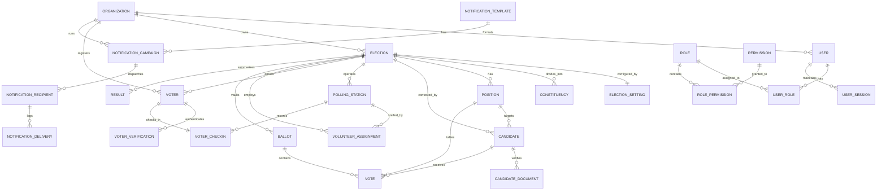

# Database Entity Relationship Design & Schema

## Relational Schema Diagram (Mermaid)

## Key Entities & Field Descriptions

| Table Name | Primary Key | Key Relationships | Purpose |
| :--- | :--- | :--- | :--- |
| `organizations` | `id` (UUID) | One-to-many with users, elections, voters | Tenant isolation boundary |
| `users` | `id` (UUID) | FK `organization_id`, M2M with roles | User authentication & profiles |
| `roles` | `id` (UUID) | M2M with users and permissions | RBAC role definitions |
| `permissions` | `id` (UUID) | M2M with roles | Granular action strings |
| `elections` | `id` (UUID) | FK `organization_id` | Core election lifecycle entity |
| `positions` | `id` (UUID) | FK `election_id`, `constituency_id` | Electoral offices/posts |
| `candidates` | `id` (UUID) | FK `election_id`, `position_id` | Nominated candidates & profiles |
| `voters` | `id` (UUID) | FK `election_id`, `polling_station_id` | Electoral roll records |
| `voter_checkins` | `id` (UUID) | FK `voter_id`, `election_id` | Unique check-in timestamps |
| `ballots` | `id` (UUID) | FK `election_id` (NO voter reference!) | Anonymous encrypted ballot vault |
| `votes` | `id` (UUID) | FK `ballot_id`, `position_id`, `candidate_id` | Anonymous candidate selections |
| `results` | `id` (UUID) | FK `election_id`, `candidate_id` | Certified vote counts and ranks |
| `audit_logs` | `id` (UUID) | Append-only audit trail | Immutable compliance records |
| `security_events` | `id` (UUID) | Security incident records | Intrusion & anomaly monitoring |
